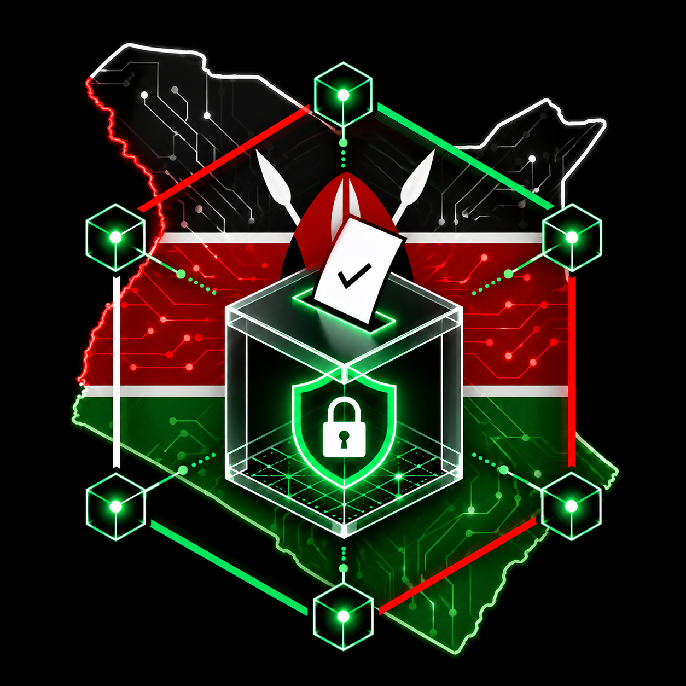

<div align="center">



# IEBC Blockchain Voting System

### Secure. Transparent. Tamper-Proof.

*A blockchain-based multi-level electoral system for Kenya's General Elections*

---


---

**Karatina University** &nbsp;|&nbsp; Bachelor of Science in Computer Science
**Reg No:** P101/2264G/22 &nbsp;|&nbsp; **Author:** Joshua Muhoro Ndirangu
**Academic Year:** 2025/2026

</div>

---

## Table of Contents

- [Overview](#overview)
- [System Architecture](#system-architecture)
- [Tech Stack](#tech-stack)
- [Project Structure](#project-structure)
- [Features](#features)
- [Prerequisites](#prerequisites)
- [Installation](#installation)
- [Smart Contract Deployment](#smart-contract-deployment)
- [Database Setup](#database-setup)
- [Running the System](#running-the-system)
- [API Reference](#api-reference)
- [Voter Verification Flow](#voter-verification-flow)
- [Blockchain Vote Flow](#blockchain-vote-flow)
- [Test Credentials](#test-credentials)
- [Roadmap](#roadmap)
- [License](#license)

---

## Overview

The **IEBC Blockchain Voting System** is a full-stack decentralised application that enables secure, transparent, and auditable multi-level elections for Kenya. It addresses key challenges in Kenya's electoral process — ballot tampering, voter fraud, result manipulation, and lack of transparency — by recording every vote as an immutable transaction on the Ethereum blockchain.

The system supports all **six elective positions** under Kenya's Constitution 2010:

| # | Position | Level |
|---|----------|-------|
| 1 | President of Kenya | National |
| 2 | County Governor | County |
| 3 | Senator | County |
| 4 | Member of Parliament | Constituency |
| 5 | Women Representative | County |
| 6 | Member of County Assembly (MCA) | Ward |

---

## System Architecture

```
┌─────────────────────────────────────────────────────────────┐
│                     CLIENT LAYER                            │
│           React.js Frontend  (Port 3000)                    │
│   Voter Portal  │  Admin Dashboard  │  Results Page         │
└────────────────────────┬────────────────────────────────────┘
                         │ REST API  (JWT Auth)
┌────────────────────────▼────────────────────────────────────┐
│                      API LAYER                               │
│           Node.js + Express.js  (Port 5000)                 │
│   Auth Routes │ Election Routes │ Vote Routes                │
│   Rate Limiting │ Helmet Security │ CORS                     │
└──────────┬──────────────────────────┬───────────────────────┘
           │                          │
┌──────────▼──────────┐   ┌───────────▼─────────────────────┐
│    DATA LAYER       │   │       BLOCKCHAIN LAYER           │
│    PostgreSQL DB    │   │   Ganache  (Local Testnet)       │
│    Users & Voters   │   │   Voting.sol Smart Contract      │
│    Elections        │   │   Server-side TX Signing         │
│    Audit Logs       │   │   Immutable Vote Records         │
└─────────────────────┘   └──────────────────────────────────┘
                                       │
                          ┌────────────▼────────────────────┐
                          │      AI AGENT LAYER             │
                          │   OpenClaw + WhatsApp           │
                          │   Civic Education Bot (Elimu)   │
                          └─────────────────────────────────┘
```

---

## Tech Stack

| Layer | Technology | Version | Purpose |
|-------|-----------|---------|---------|
| Frontend | React.js | 18.x | Voter and Admin UI |
| Frontend | React Router | 6.x | Client-side routing |
| Frontend | Axios | 1.x | HTTP API requests |
| Backend | Node.js | 22.x | Runtime environment |
| Backend | Express.js | 4.x | REST API framework |
| Backend | JWT | 9.x | Authentication tokens |
| Backend | bcryptjs | 2.x | Password hashing |
| Backend | Helmet | 7.x | HTTP security headers |
| Database | PostgreSQL | 16.x | Relational data store |
| Blockchain | Solidity | 0.8.x | Smart contract language |
| Blockchain | Web3.js | 4.x | Ethereum interaction |
| Blockchain | Ganache | 7.x | Local Ethereum testnet |
| AI Agent | OpenClaw | latest | WhatsApp civic education bot |

---

## Project Structure

```
IEBC-Blockchain/
│
├── backend/                           # Node.js + Express API
│   ├── config/
│   │   ├── db.js                      # PostgreSQL connection pool
│   │   └── blockchain.js              # Web3 + contract loader
│   ├── controllers/
│   │   ├── authController.js          # Login, register, OTP
│   │   ├── electionController.js      # Election CRUD + results
│   │   └── voteController.js          # Vote casting + verification
│   ├── middleware/
│   │   └── auth.js                    # JWT auth, isAdmin, isVoter
│   ├── models/
│   │   ├── Election.js                # Election DB queries
│   │   └── vote.js                    # Vote DB queries
│   ├── routes/
│   │   ├── authRoutes.js              # /api/auth/*
│   │   ├── electionRoutes.js          # /api/elections/*
│   │   └── voteRoutes.js              # /api/votes/*
│   ├── scripts/
│   │   └── seedDatabase.js            # Seed DB with test data
│   ├── services/
│   │   └── blockchainService.js       # Blockchain tx signing
│   ├── database.sql                   # Full DB schema
│   ├── server.js                      # App entry point
│   └── .env                           # Environment variables
│
├── frontend/                          # React.js application
│   └── src/
│       ├── components/
│       │   ├── Voter/
│       │   │   ├── VotingBooth.jsx    # Main ballot interface
│       │   │   └── VoterProfile.jsx   # Voter dashboard
│       │   ├── Admin/
│       │   │   ├── AdminDashboard.jsx
│       │   │   └── pages/             # Admin management pages
│       │   ├── VoterLogin.jsx         # Login + registration
│       │   ├── VoterDeclaration.jsx   # Pre-vote declaration
│       │   └── ResultsPage.jsx        # Public results
│       ├── services/
│       │   ├── api.js                 # Axios instance + endpoints
│       │   └── blockchainService.js   # Read-only blockchain calls
│       └── styles/                    # CSS stylesheets
│
├── smart-contracts/                   # Solidity contracts
│   ├── contracts/
│   │   └── Voting.sol                 # Main voting contract
│   ├── scripts/
│   │   ├── compile.js                 # Compile contract
│   │   ├── deploy.js                  # Deploy to Ganache
│   │   └── setupElection.js           # Seed positions + candidates
│   └── abi/
│       ├── Voting.json                # Contract ABI
│       ├── bytecode.bin               # Compiled bytecode
│       └── contract.json             # Deployed address + ABI
│
└── README.md
```

---

## Features

### Voter Features
- National ID or Passport login
- OTP verification after registration (phone/email)
- Pre-vote legal declaration
- Ballot for all 6 elective positions
- Server-side blockchain signing — no MetaMask required
- Unique verification code per vote
- Blockchain receipt with transaction hash
- Public vote verification by code

### Admin Features
- Secure IEBC official login
- Election lifecycle management
- Candidate and position management
- Real-time vote count monitoring
- Full audit log trail
- Voter registration management

### Blockchain Features
- Every vote recorded as an immutable on-chain transaction
- Server signs all transactions — voters need no wallet
- Smart contract enforces one vote per position
- Verification codes stored on-chain
- Election activation and deactivation by admin only

### AI Civic Education Agent
- WhatsApp bot named **Elimu** powered by OpenClaw
- Answers voter FAQs in English and Swahili
- Explains all 6 elective positions
- Verifies vote codes against blockchain
- Checks voter registration status
- Available 24/7 without human intervention

---

## Prerequisites

```
Node.js        >= 22.14.0
PostgreSQL     >= 14.x
Ganache        >= 7.x
Git            latest
```

---

## Installation

### 1. Clone the repository

```bash
git clone https://github.com/muhoro/iebc-blockchain.git
cd IEBC-Blockchain
```

### 2. Install dependencies

```bash
# Backend
cd backend && npm install

# Frontend
cd ../frontend && npm install

# Smart contracts
cd ../smart-contracts && npm install
```

### 3. Configure environment variables

```bash
cd backend
cp .env.example .env
```

Edit `backend/.env`:

```env
PORT=5000
CLIENT_URL=http://localhost:3000

DB_HOST=localhost
DB_PORT=5432
DB_NAME=voting_db
DB_USER=postgres
DB_PASSWORD=your_password

JWT_SECRET=your_64_char_random_secret

BLOCKCHAIN_RPC_URL=http://127.0.0.1:7545
SERVER_ETH_ADDRESS=0xYourGanacheAccount0Address
SERVER_ETH_PRIVATE_KEY=0xYourGanacheAccount0PrivateKey
```

Edit `frontend/.env`:

```env
REACT_APP_API_URL=http://localhost:5000/api
```

---

## Database Setup

```bash
# Create database
psql -U postgres -c "CREATE DATABASE voting_db;"

# Run schema
psql -U postgres -d voting_db -f backend/database.sql

# Seed test data
cd backend && npm run seed
```

---

## Smart Contract Deployment

```bash
cd smart-contracts

# Step 1 — Compile
node scripts/compile.js

# Step 2 — Deploy to Ganache (ensure Ganache is running on port 7545)
node scripts/deploy.js

# Step 3 — Add positions, candidates, and activate election
node scripts/setupElection.js
```

After deployment, copy the contract address from `smart-contracts/abi/contract.json`
and ensure it matches the address in `frontend/src/services/contractABI.json`.

---

## Running the System

Open three terminals:

```bash
# Terminal 1 — Backend
cd backend && node server.js

# Terminal 2 — Frontend
cd frontend && npm start

# Terminal 3 — Keep Ganache running on port 7545
```

Visit: **http://localhost:3000**

Health check: **http://localhost:5000/api/health**

---

## API Reference

### Authentication — `/api/auth`

| Method | Endpoint | Auth | Description |
|--------|----------|------|-------------|
| POST | `/voter/login` | Public | Voter login by National ID |
| POST | `/admin/login` | Public | Admin login by email |
| POST | `/register` | Public | New voter registration |
| POST | `/verify-otp` | Public | OTP account activation |
| POST | `/resend-otp` | Public | Resend OTP code |
| POST | `/verify-voter` | Public | Check registration status |
| GET | `/me` | JWT | Get current user |
| POST | `/logout` | JWT | Logout |

### Elections — `/api/elections`

| Method | Endpoint | Auth | Description |
|--------|----------|------|-------------|
| GET | `/active` | JWT | Get active election |
| GET | `/:id/positions` | JWT | Positions with candidates |
| GET | `/results/:id` | Public | Published results |
| GET | `/` | Admin | All elections |
| POST | `/` | Admin | Create election |
| PATCH | `/:id/status` | Admin | Update election status |

### Votes — `/api/votes`

| Method | Endpoint | Auth | Description |
|--------|----------|------|-------------|
| POST | `/cast` | Voter | Cast a vote |
| POST | `/verify` | Public | Verify vote by code |
| GET | `/counts/:electionId` | JWT | Live vote counts |
| GET | `/blockchain/:electionId` | Admin | Blockchain status |

---

## Voter Verification Flow

```
Register
  └─► 1. National ID Check    — ID must exist in voters register
  └─► 2. OTP Verification     — 6-digit code to phone/email (10 min expiry)

Login
  └─► 3. Eligibility Check    — account active + has not yet voted
  └─► 4. Voter Declaration    — legal consent logged in audit trail

Vote
  └─► 5. Ballot               — one position at a time, 6 positions total
  └─► 6. Blockchain Receipt   — verification code + transaction hash
```

---

## Blockchain Vote Flow

```
Voter selects candidate on frontend
           ↓
POST /api/votes/cast  (Bearer JWT)
           ↓
Backend validates:
  - Election is active
  - Voter is registered and active
  - Not already voted for this position
           ↓
Generate unique verification code  V-XXXXXXXX
           ↓
Sign transaction with SERVER_ETH_PRIVATE_KEY
           ↓
Broadcast to Ganache → Voting.sol.vote(positionId, candidateId, code)
           ↓
Record in PostgreSQL: tx hash + verification code + voter_id
           ↓
Return receipt to voter (code + tx hash + block number)
```

> No voter wallet or MetaMask required at any point.

---

## Test Credentials

| Role | Identifier | Password |
|------|-----------|----------|
| Voter | `12345678` (National ID) | `Voter@2027` |
| Admin | `admin@iebc.or.ke` | `Admin@2027` |

---

## Roadmap

- [x] Backend REST API with JWT authentication
- [x] PostgreSQL schema with full audit trail
- [x] Solidity smart contract deployed to Ganache
- [x] React frontend — voter portal and voting booth
- [x] React frontend — admin dashboard
- [x] Voter OTP verification after registration
- [x] Pre-vote legal declaration
- [x] Server-side blockchain vote signing
- [x] Vote verification by code
- [x] OpenClaw civic education WhatsApp agent (Elimu)
- [ ] Africa's Talking SMS OTP delivery
- [ ] QR code vote receipt (downloadable PDF)
- [ ] Live results WebSocket dashboard
- [ ] County-level choropleth results map (React-Leaflet)
- [ ] Cloud deployment (Railway + Vercel)
- [ ] Zero-knowledge proof voter privacy (circom + snarkjs)

---

## Academic Context

Developed as a final year research project at **Karatina University**, addressing:

> *"How can blockchain technology be applied to ensure the integrity, transparency, and security of Kenya's multi-level electoral process?"*

**Key contributions:**
- Decentralised vote recording using Ethereum smart contracts
- Voter anonymity through server-side transaction signing
- Tamper-proof audit trails using blockchain immutability
- Full multi-level election support matching Kenya's constitutional structure
- AI-powered civic education accessible via WhatsApp

---

## License

This project is licensed under the [MIT License](LICENSE).

---

<div align="center">


**IEBC Blockchain Voting System**
Built with integrity for Kenya's democratic future.

*Karatina University — Computer Science — 2025/2026*

</div>